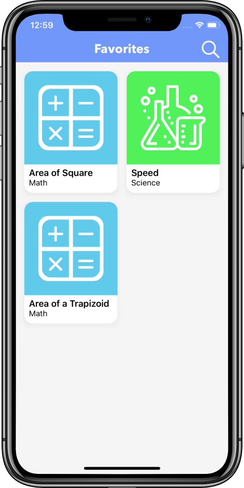
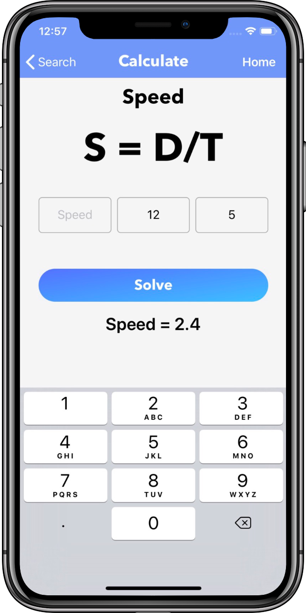
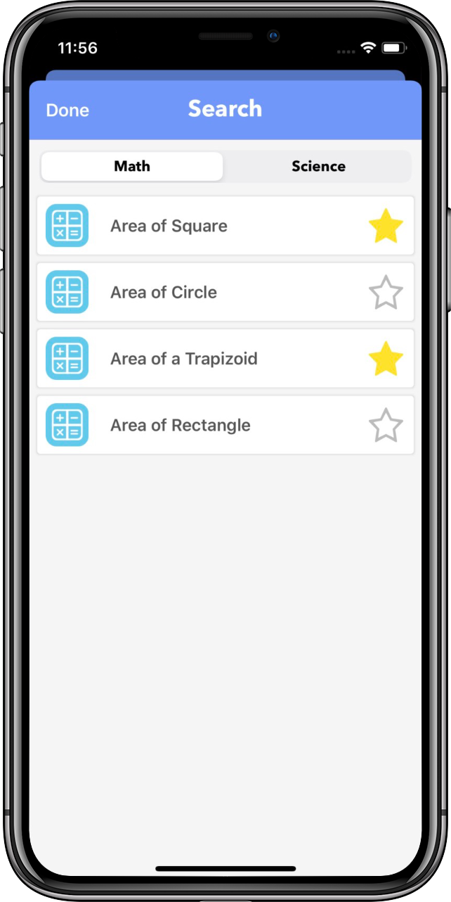

# Quick Formula
[Quick Formula](https://apps.apple.com/us/app/quick-formula/id1462553451?ls=1) calculates math and science formulas. Uses a segmented control to separate math and science formulas.  Available in the App Store.

Quick Formula is built entirely in Swift and the UI is created programmatically with no interface builder.

&nbsp;&nbsp;&nbsp;&nbsp;&nbsp;&nbsp;&nbsp;&nbsp;&nbsp;&nbsp;&nbsp;&nbsp;&nbsp;&nbsp;&nbsp;&nbsp

